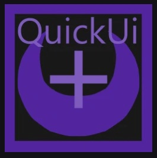

# QuickUI+ - Created by le_killeur338

> The official documentation of the roblox studio plugin for Ui QuickUi+

[Installation](#installation) •
[Documentation](#documentation) •
[Exemples](#exemples)

---

## ✨ Présentation

QuickUI+ is a roblox studio plugin based on create Ui fastly and easily,
It includes numerous features that are explained in this documentation; 
however, this documentation may not be complete. For further information, please contact the staff or the creator directly on Discord.

It allows you to, among other things:

- 🖼️ Create interfaces fastly
- 🔘 Add textures in one click
- 📝 Add different tweento your Uis
- 📐 scale and other actions
- 🎨 Convert And copy your UIS
- ✨ A full Ui Animator 
- ⚡ Speed ​​up interface creation

---

## 📦 Installation

1. Open a Roblox Studio place.
2. Oen the ToolBox
3. Search **QuickUI+** in plugin
4. Click on the first one
5. Install it
6. Accept **Script injection**

---

## 📚 Documentation

### General

- [Installation](docs/installation.md)
- [link](docs/interface.md)

### Composants

- [Main](docs/components/frames.md)
     - [Buttons](docs/components/buttons.md)
- [More Tools](docs/components/text.md)
     - [Images](docs/components/images.md)

### Fonctionnalités

- [Layouts](docs/features/layouts.md)
- [Anchors](docs/features/anchors.md)
- [Animations](docs/features/animations.md)

### Autres

- [FAQ](docs/faq.md)

---

## 🖼️ Aperçu

---

## 🛠️ Support

Si vous rencontrez un problème, ouvrez une
[issue](../../issues) sur GitHub.

---

## 📄 Licence

Copyright © 2026 QuickUI+
