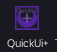

## Main Frame

You can open the main frame by clicking here:

 .

 The **MainFrame** includes 6 tab : 

 1. Tween 
 2. Auto-Scale
 3. Auto-Script
 4. Assets
 5. One-TopBar
 6. Textures [TextureFrame](textureframe.md)

and a Settings Frame
[Settings](Settings.md)
