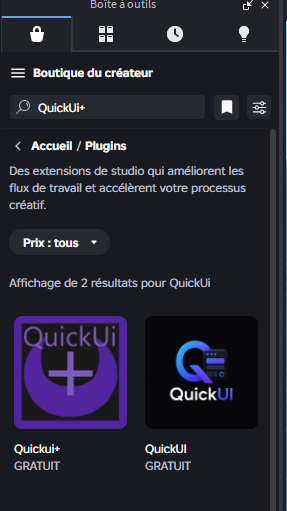
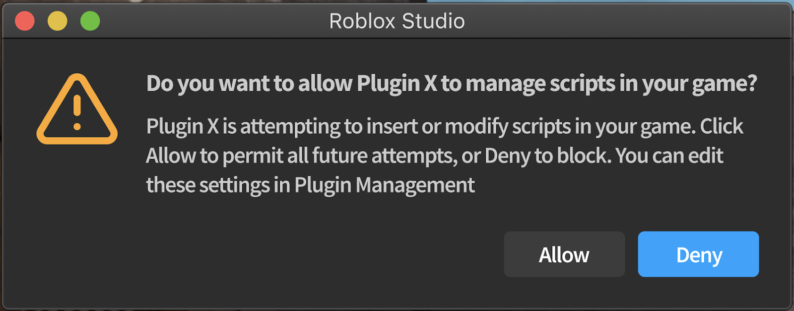
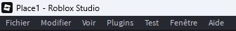
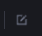

# How to install QuickUi+ 

This page explains how to install and answer to the current question on the plugin

## 📦 Installation

1. Open a Roblox Studio place.
2. Open the ToolBox
3. Search **QuickUI+** in plugin

4. Click on the first one
5. Install it
6. Accept **Script injection** : 

## If you clicked on refuse by error

1 - Click on Plugin on the very top right of ur script.

2 - Click on Manage plugin
3 - click on this button 

